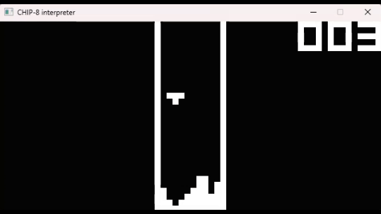

# CHIP-8 Interpreter

[](https://github.com/scnplt/chip8-interpreter/actions/workflows/rust.yml)
[](https://github.com/scnplt/chip8-interpreter/blob/main/LICENSE.md)  

*CHIP-8 is an interpreted programming language, developed by Joseph Weisbecker. It was initially used on the COSMAC VIP and Telmac 1800 8-bit microcomputers in the mid-1970s.* [[1]](#references)

## Demo

  
[Tetris [Fran Dachille, 1991]](https://github.com/dmatlack/chip8/blob/master/roms/games/Tetris%20%5BFran%20Dachille%2C%201991%5D.ch8)


## Usage

**Requirements:** [SDL2](https://www.libsdl.org/)  
- [Windows (MinGW)](https://github.com/Rust-SDL2/rust-sdl2#windows-mingw)
- [Windows (MSVC)](https://github.com/Rust-SDL2/rust-sdl2#windows-msvc)
- [Linux](https://github.com/Rust-SDL2/rust-sdl2#linux)
- [macOS](https://github.com/Rust-SDL2/rust-sdl2#macos)

Clone the project

```bash
  git clone https://github.com/scnplt/chip8-interpreter
  cd chip8-interpreter
```

Build

```bash
  cargo build
```

Run

```bash
  cargo run
```

Help

```console
USAGE:
    chip8-interpreter [OPTIONS]

FLAGS:
    -h, --help       Prints help information
    -V, --version    Prints version information

OPTIONS:
    -d, --delay <delay (ms)>
            Inter-cycle delay time [default: 2]

    -r, --rom <rom path>
            Sets a custom ch8 rom [default: ./roms/Tetris [Fran Dachille, 1991].ch8]
```

## References
 
 - [[1] CHIP-8 - Wikipedia](https://en.wikipedia.org/wiki/CHIP-8)
 - [Columbia University - Chip-8 Design Specification](http://www.cs.columbia.edu/~sedwards/classes/2016/4840-spring/designs/Chip8.pdf)
 - [Cowgod's Chip-8 Technical Reference](http://devernay.free.fr/hacks/chip8/C8TECH10.HTM#3.0)
 - [Rust ile CHIP-8 Emülatörü Geliştirme](https://onur.github.io/chip8/giris.html)
 - [Building a CHIP-8 Emulator [C++]](https://austinmorlan.com/posts/chip8_emulator/)
 - [Guide to making a CHIP-8 emulator](https://tobiasvl.github.io/blog/write-a-chip-8-emulator/)
 - [Test ROM](https://github.com/corax89/chip8-test-rom)


## MIT License

Copyright (c) 2021 Sertan Canpolat

Permission is hereby granted, free of charge, to any person obtaining a copy
of this software and associated documentation files (the "Software"), to deal
in the Software without restriction, including without limitation the rights
to use, copy, modify, merge, publish, distribute, sublicense, and/or sell
copies of the Software, and to permit persons to whom the Software is
furnished to do so, subject to the following conditions:

The above copyright notice and this permission notice shall be included in all
copies or substantial portions of the Software.

THE SOFTWARE IS PROVIDED "AS IS", WITHOUT WARRANTY OF ANY KIND, EXPRESS OR
IMPLIED, INCLUDING BUT NOT LIMITED TO THE WARRANTIES OF MERCHANTABILITY,
FITNESS FOR A PARTICULAR PURPOSE AND NONINFRINGEMENT. IN NO EVENT SHALL THE
AUTHORS OR COPYRIGHT HOLDERS BE LIABLE FOR ANY CLAIM, DAMAGES OR OTHER
LIABILITY, WHETHER IN AN ACTION OF CONTRACT, TORT OR OTHERWISE, ARISING FROM,
OUT OF OR IN CONNECTION WITH THE SOFTWARE OR THE USE OR OTHER DEALINGS IN THE
SOFTWARE.
